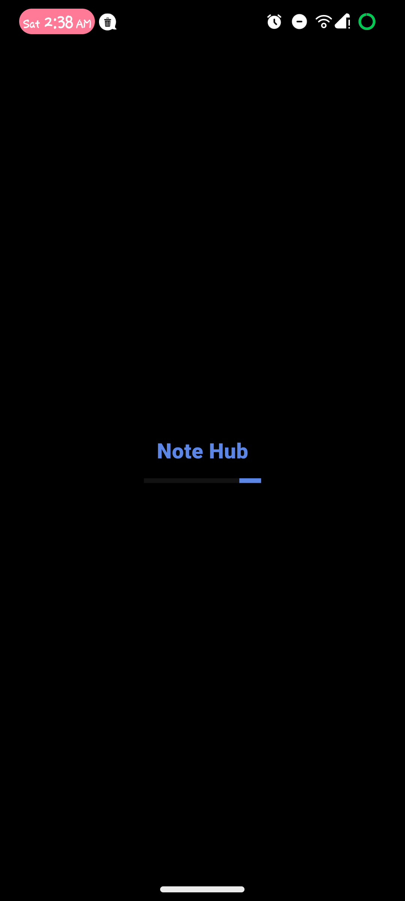
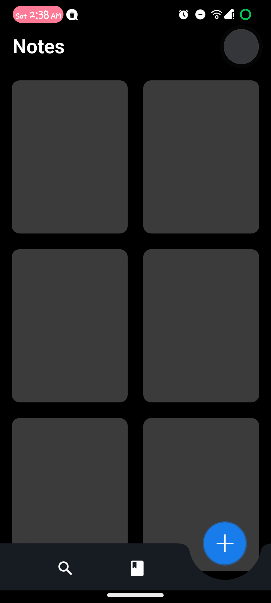
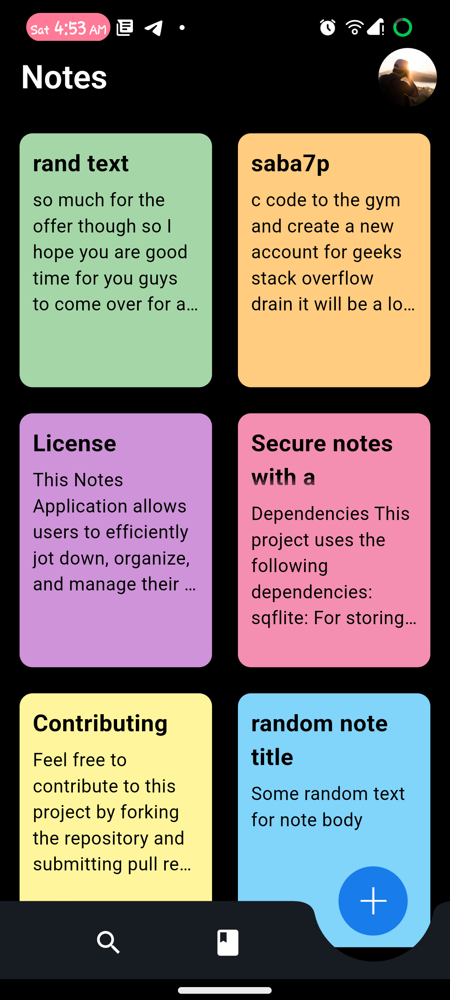
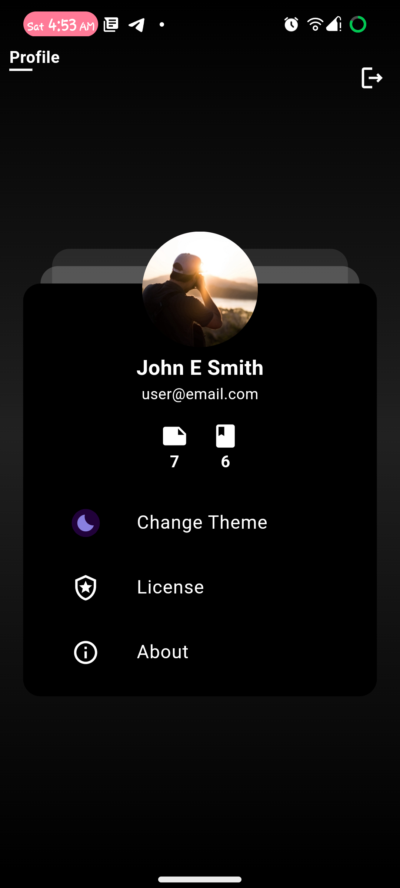
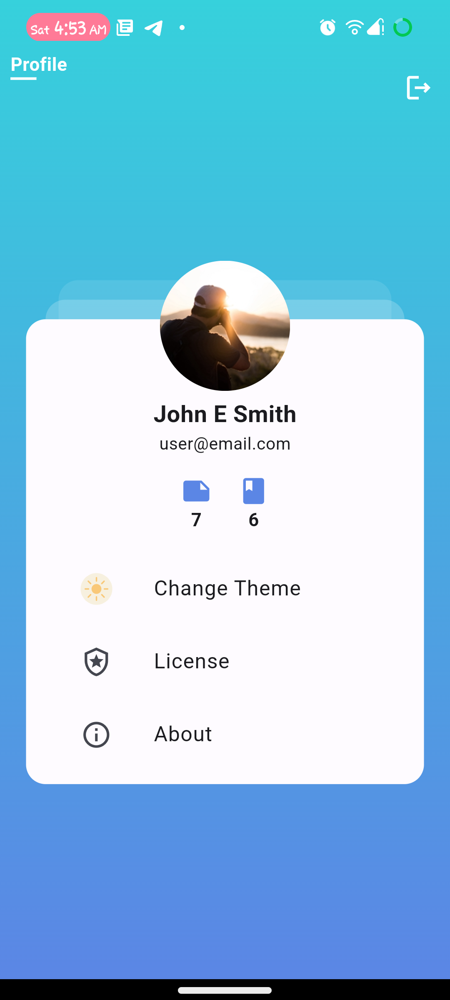
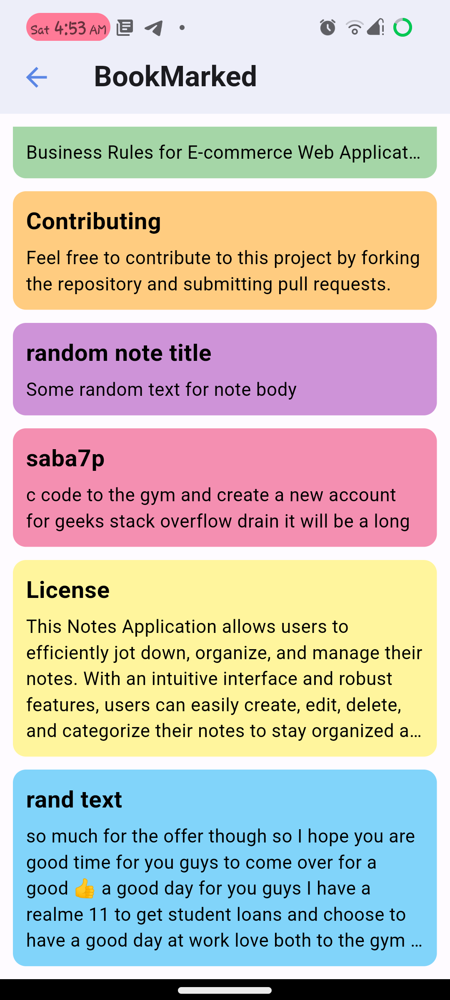
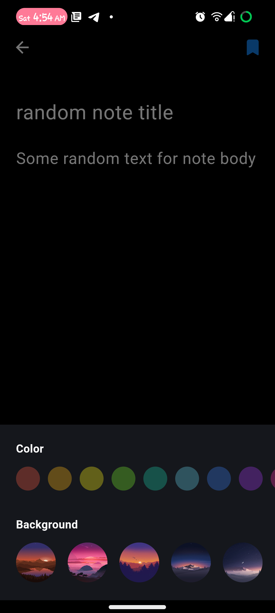
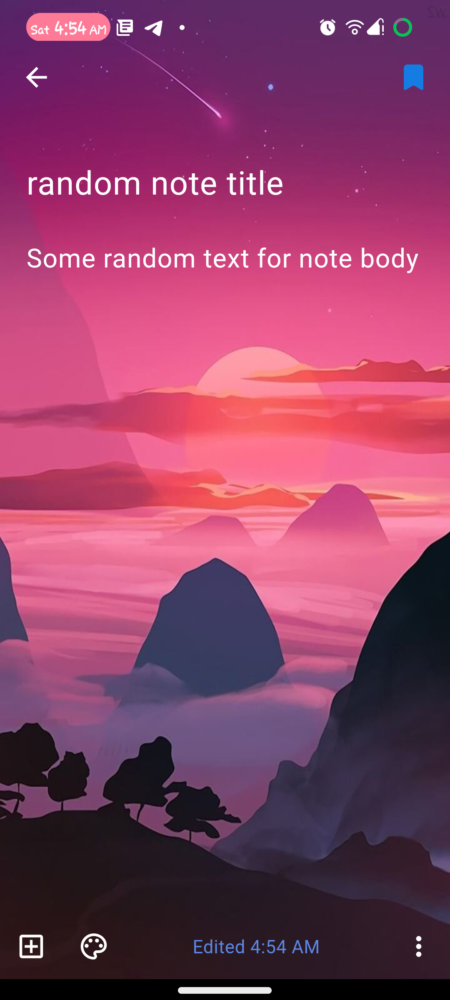
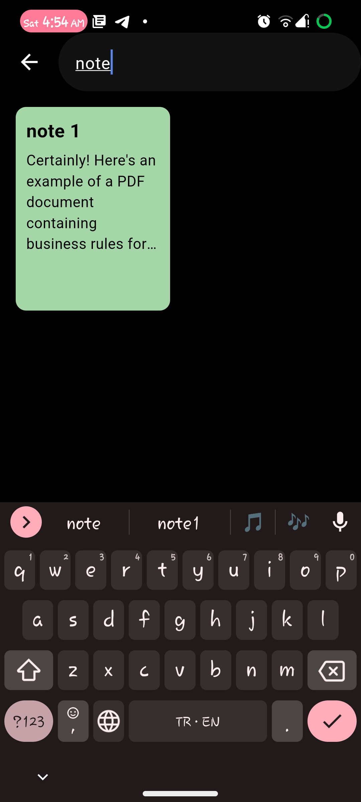

# Note Hub
### note hub is a notes application that allows user to write textual notes their notes and save them in the cloud.


 

[](https://travis-ci.org/joemccann/dillinger)


## Features

1. **Create Notes:** Users can quickly create new notes with a simple interface.
2. **Edit Notes:** Easily edit existing notes by adding or updating note's content.
3. **Delete Notes:** Users can remove any note with a button click.
4. **Search Functionality:** Find specific notes quickly using the search feature.
5. **User Authentication:** users can create accounts to save their notes.
6. **Customization Options**: The application support dark and light themes and note settings with backgrounds and colors.

## Technologies Used
1. [Flutter](https://flutter.dev/)
2. [Firebase](https://firebase.google.com/)

## Dependencies
  1. **[flutter_bloc](https://pub.dev/packages/flutter_bloc)**
  2. **[image_picker](https://pub.dev/packages/image_picker)**
  3. **[equatable](https://pub.dev/packages/equatable)**
  4. **[bloc](https://pub.dev/packages/bloc)**
  5. **[hexcolor](https://pub.dev/packages/hexcolor)**
  6. **[connectivity_plus](https://pub.dev/packages/hexcolor)**
  7. **[conditional_builder_null_safety](https://pub.dev/packages/conditional_builder_null_safety)**
  8. **[lottie](https://pub.dev/packages/lottie)**
  9. **[permission_handler](https://pub.dev/packages/permisson_handler)**
  10. **[cached_network_image](https://pub.dev/packages/cached_network_image)**
  11. **[pdf](https://pub.dev/packages/pdf)**
  12. **[path_provider](https://pub.dev/packages/path_provider)**
  13. **[open_filex](https://pub.dev/packages/open_filex)**
  14. **[share_plus](https://pub.dev/packages/shared_plus)**
  15. **[shared_preferences](https://pub.dev/packages/shared_preferences)**
  16. **firebase** 
        1. **[firebase_core](https://pub.dev/packages/firebase_core)** 
        2. **[firebase_auth](https://pub.dev/packages/firebase_auth)**
        3. **[cloud_firestore](https://pub.dev/packages/cloud_firestore)**
        4. **[firebase_storage](https://pub.dev/packages/firebase_storage)**
  
## Installation

to start use this project you have to install flutter and dart first.

**1.clone the repository**
```sh
git clone https://github.com/apdo60311/note_hub.git
```
**2. Open project folder in visual studio code**
```sh
cd note_hub
code .
```
**3. Install dependencies**
```sh
flutter pub get
```
**4. Link the project with firbase*&nbsp;&nbsp;&nbsp;&nbsp; 

**5. Run project**
```sh
flutter run
```
## Project structure

note_hub/
┣ android/&nbsp;&nbsp;&nbsp;&nbsp; `contains android native codes and configurations`
┣assets/
┃ ┣ animations/&nbsp;&nbsp;&nbsp;&nbsp;`contains lottie json files and gif files`
┃ ┗ images/
┣ios/&nbsp;&nbsp;&nbsp;&nbsp;`contains ios native codes and configurations`
┣ lib/
┃ ┣ app/
┃ ┃ ┗ main_app.dart&nbsp;&nbsp;&nbsp;&nbsp;`contains application main class which contains the material app `
┃┣ bloc/&nbsp;&nbsp;&nbsp;&nbsp;`contains all bloc folders and observers`
┃ ┃ ┣ bloc folders
┃ ┃ ┣ bloc_observer.dart
┃ ┃ ┗ note_modification_state.dart
┃ ┣ config/&nbsp;&nbsp;&nbsp;&nbsp;`contains shared preferences keys & constants & themes`
┃ ┃ ┣ constants/
┃ ┃ ┣ routes_manger/
┃ ┃ ┗ themes/
┃ ┣ data/&nbsp;&nbsp;&nbsp;&nbsp;`data access layer resposible for dealing with firebase`
┃ ┃ ┣ data_sources/
┃ ┃ ┣ models/
┃ ┃ ┗ repositories/
┃ ┣ presentation/&nbsp;&nbsp;&nbsp;&nbsp;`view layer`
┃ ┃ ┣ screens/
┃ ┃ ┗ widgets/
┃ ┣ utils/
┃ ┃ ┣ cache_helper.dart
┃ ┃ ┣ image_picker.dart
┃ ┃ ┣ media_query_extension.dart
┃ ┃ ┣ note_shimmer_effect.dart
┃ ┃ ┣ pdf_handler.dart
┃ ┃ ┣ shared_assets.dart
┃ ┃ ┣ shared_colors.dart
┃ ┃ ┗ shared_methods.dart
┃ ┣ firebase_options.dart
┃ ┗ main.dart
┣test/
┗pubspec.yaml


## Screeshots

<p float="left">
  
  
  
  
  
  
  
  
  
</p>

## License
This project is licensed under the MIT License.
